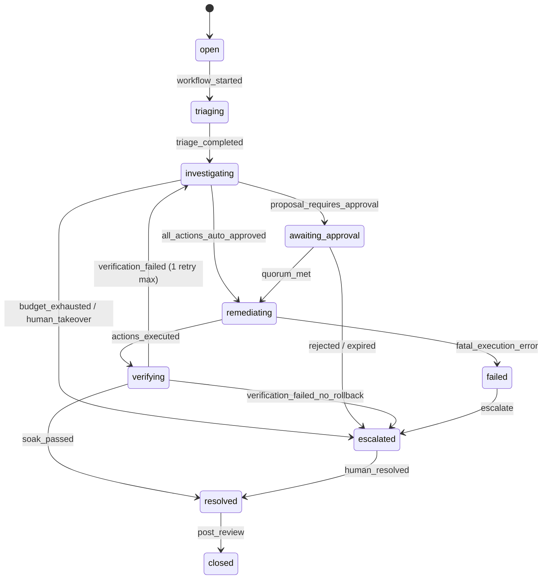
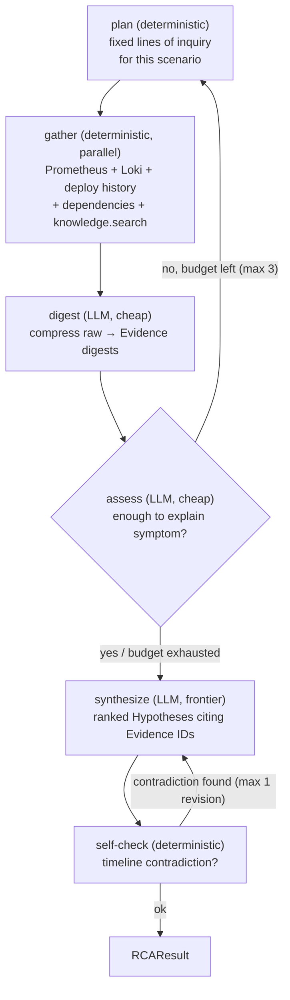

# 1. Signature Incident Lifecycle — End-to-End Design

## 1.1 Purpose and scope

This document specifies, end-to-end, the one incident scenario AIC must handle exceptionally well
before anything else is built: a bad deployment causing latency, errors, database connection pool
exhaustion, and downstream checkout failures. Every stage of

```
OBSERVE → DETECT → CORRELATE → INVESTIGATE → REASON → FORM RCA → PLAN REMEDIATION
        → APPLY POLICY → APPROVE → ACT → VERIFY → RESOLVE → LEARN
```

is specified concretely enough to build from: what runs, what data moves, what's deterministic
code versus an LLM call and why, and what the failure paths are. Breadth (more alert sources, more
agents, more integrations) is explicitly out of scope until this one path is real, tested, and
explainable end-to-end — see §17.

Four architectural forks this design depends on are recorded separately as ADRs: LangGraph as the
investigation graph executor ([ADR 0001](../adr/0001-langgraph-for-investigation-orchestration.md)),
Kafka for alert-event propagation ([ADR 0002](../adr/0002-kafka-for-alert-event-propagation.md)),
a local Kubernetes cluster as the remediation target
([ADR 0003](../adr/0003-kubernetes-remediation-target.md)), and LiteLLM as the LLM gateway
([ADR 0004](../adr/0004-litellm-gateway-for-llm-access.md)).

## 1.2 The scenario

`payment-service` is redeployed at version `v42` with `DB_POOL_SIZE` misconfigured (20 → 3). A
load generator keeps sending realistic traffic through `checkout-service → payment-service →
Postgres`. The undersized pool genuinely exhausts under real load: `payment-service` p99 latency
rises, its 5xx rate rises, its Postgres connection-pool-in-use metric pins at its cap, and
`checkout-service`'s own error rate rises in turn because its calls to `payment-service` start
failing. Nothing here is simulated data — it is a real misconfiguration producing real symptoms in
real running services, because an AIC that can only reason over canned data hasn't proven
anything about investigating a real failure.

## 1.3 System topology

```
                         ┌─────────────────────────────────────────┐
                         │              kind cluster                │
                         │              ns: aic-demo                 │
                         │                                           │
  load-generator ───────▶│  checkout-service ──────▶ payment-service │
       (k6/locust-ish     │        │                       │        │
        FastAPI script)   │        │                       ▼        │
                         │        │                    Postgres     │
                         │        │                    (pool=3)     │
                         │        ▼                                 │
                         │   /metrics, JSON logs stdout (both svcs)  │
                         └───────────┬───────────────┬───────────────┘
                                     │ scrape        │ tail (Promtail)
                                     ▼               ▼
                         ┌──────────────┐   ┌──────────────┐
                         │  Prometheus   │   │     Loki      │
                         │  + alert rules│   │               │
                         └──────┬────────┘   └───────────────┘
                                │ breach
                                ▼
                         ┌──────────────┐
                         │ Alertmanager  │
                         └──────┬────────┘
                                │ webhook
                                ▼
                  ┌──────────────────────────┐
                  │        aic-ingest         │
                  │  normalize → AlertEvent   │
                  └──────────┬─────────────────┘
                             │ produce
                             ▼
                  ╔═══════════════════════╗
                  ║  Kafka topic:          ║
                  ║  alert-events          ║   (ADR 0002)
                  ╚═══════════╤═══════════╝
                              │ consume (group: aic-correlator)
                              ▼
                  ┌──────────────────────────┐
                  │       correlator          │
                  │  dependency-graph +        │
                  │  time-window grouping      │
                  └──────────┬─────────────────┘
                             │ opens/updates
                             ▼
                  ┌──────────────────────────┐        ┌────────────────────┐
                  │         Incident          │───────▶│   PostgreSQL        │
                  │   (state machine, §6)     │        │  system of record   │
                  └──────────┬─────────────────┘        └────────────────────┘
                             │ triggers
                             ▼
                  ┌──────────────────────────┐
                  │  LangGraph investigation   │  (ADR 0001)
                  │  graph — §7                │──── read-only tools ───▶ Prometheus, Loki,
                  └──────────┬─────────────────┘                          K8s API, deployment
                             │                                            history, knowledge store
                             ▼
                  RCA → RemediationProposal → Policy → Approval → Executor
                                                                     │
                                                          write-scoped K8s ServiceAccount
                                                                     ▼
                                                    kubectl rollout undo (ADR 0003)
                                                                     │
                                                                     ▼
                                                              Verify → Resolve → Learn
                                                                             │
                                                                             ▼
                                                                    Qdrant (knowledge store)

  LLM calls (Reason / Plan / Learn stages) route through LiteLLM (ADR 0004).
```

## 1.4 Lifecycle stage-by-stage

| Stage | What happens | Deterministic or LLM | Why |
|---|---|---|---|
| OBSERVE | Prometheus scrapes `http_request_duration_seconds` (histogram → p99), `http_requests_total{status}` (→ 5xx rate), `db_pool_connections_in_use` every 5s from both services; Promtail ships structured JSON logs to Loki | Infra only | Nothing to decide |
| DETECT | Three independent Alertmanager rules breach within seconds of each other: `HighLatencyPaymentService`, `HighErrorRatePaymentService`, `DBPoolExhaustionPaymentService`. Each fires a webhook to `aic-ingest` | Deterministic (Alertmanager's rule engine) | Threshold detection is solved; AIC consumes it, doesn't reinvent it |
| CORRELATE | Each webhook becomes a canonical `AlertEvent`, produced to Kafka. The correlator holds a static `ServiceDependency` table (`checkout-service depends_on payment-service`). Rule: alerts on the same service, or on services connected by a dependency edge, within a 5-minute rolling window, share one incident fingerprint. First alert opens the `Incident`; the rest attach as `IncidentSignal` rows, deduped on `(fingerprint, alert_fingerprint)` | **Fully deterministic** | Grouping by a dependency graph and a time window is exact, reproducible, and auditable — an LLM adds latency and nondeterminism for zero benefit here |
| Incident opens | `open → triaging` | Deterministic transition (§6) | — |
| TRIAGE | Severity comes from a rule table (`checkout-service + prod + ≥2 correlated signals → SEV2`). One cheap LLM call writes the human-readable incident title/summary from the correlated signals | Severity: deterministic. Title: LLM (cheap tier) | Classifying from structured labels is a lookup; turning that into a readable sentence is where language generation earns its call |
| INVESTIGATE — gather | `plan` node lists lines of inquiry (fixed for this scenario, not LLM-chosen); `gather` node fans out parallel, deterministic tool calls: real PromQL range queries (incident window vs. 1h-prior baseline), real LogQL query filtered to `level=error`, `get_deployment_history(payment-service)` against a real `deployment` table populated at deploy time, `get_service_dependencies()`, `knowledge.search()`. Every call, success or failure, becomes an `Evidence` row | **Fully deterministic gather.** LangGraph wires the nodes; no node here calls an LLM | The lines of inquiry are known for this scenario — hard-coding them is more testable and auditable than an LLM guessing which tools to call |
| digest | Raw tool output (log lines, PromQL matrices) compressed into short typed `Evidence` digests | LLM (cheap tier), one call per evidence item | Compression-with-judgment ("these 40 log lines are the same connection-timeout error") is a real language task; it's also the injection firewall (§9) |
| assess (loop) | Conditional edge: "enough evidence to explain the symptom?" If not, and iteration budget remains (max 3), loop back to `plan`/`gather`. Otherwise proceed | LLM call (cheap tier) deciding a bounded yes/no, not a fresh reasoning task | A real judgment call ("do we understand the DB angle yet") bounded by a hard iteration cap so it can never become an unbounded loop |
| REASON / FORM RCA | `recall` node queries the knowledge store (Qdrant) for similar past incidents/runbook sections. `synthesize` node: one structured-output LLM call → ranked `Hypothesis[]`, each with `statement`, `confidence`, `supporting_evidence` (Evidence IDs), `counter_evidence`. Citations validated against real Evidence IDs; a citation to a nonexistent evidence ID is a schema failure, triggering retry-with-feedback (max 2 attempts) | **LLM (frontier tier), tightly bounded output** | Interpreting *why* the pool exhaustion timing lines up with the deploy is genuine evidence interpretation, not a lookup |
| self-check | Deterministic timestamp comparison: does the deploy time cited in the top hypothesis actually precede symptom-onset time in the evidence? Contradiction → hypothesis demoted with a recorded reason, never silently trusted | **Deterministic**, not a second LLM call | "Does A precede B" is a timestamp comparison — spending an LLM call asking the model to grade its own math is theater |
| PLAN REMEDIATION | A rule matches "top hypothesis cites a deployment-correlation" → candidate type `RollbackDeployment` enters the catalog choice set. One LLM call judges among the pre-typed options (straight rollback vs. a `PatchConfig` restoring `DB_POOL_SIZE` without a full rollback) and writes the rationale. Output is a typed `RemediationProposal` — never free text | Candidate type: deterministic rule. Choice + rationale: **LLM** | Judging rollback-vs-patch is a real risk/benefit call; the LLM only ever selects among schema-validated, pre-typed options |
| APPLY POLICY | In-process, versioned rule table: `RollbackDeployment × environment=prod → require_approval(quorum=1, role=sre)`; same action type in `staging → auto_approve`. Every decision recorded with which rule + version decided it | **Deterministic**, unit-tested | One small, well-understood decision space for v1 — OPA is a real option once the rule set outgrows a table, not a day-one requirement |
| APPROVE | `ApprovalRequest` created: quorum 1, role `sre`, expiry + escalation ladder. v1 surface: authenticated API endpoint (`POST /approvals/{id}/decision`) + a one-command CLI (`aic approve <incident-id>`). Decision rows are immutable; quorum evaluated in one serializable transaction | Human decides; mechanics (identity, audit, quorum, expiry) are deterministic code | The approval gate's trust properties don't depend on which surface the human clicks through — Slack is a later delivery-channel swap, not a v1 requirement |
| ACT | Approved action executes through the **executor** — a separate code path holding a write-scoped K8s `ServiceAccount` the investigation path never has access to (§11). Dry-run (`kubectl rollout undo --dry-run=server`) is attached to the approval card *before* the human decides. Idempotency key on the action row means a retried activity can't double-execute | **Deterministic executor**, typed handler per action | Privilege separation is a property of the code path and the K8s RBAC binding, not a comment — this holds even at this scale |
| VERIFY | After a soak window (90s), re-run the *exact same* Prometheus/Loki queries used in `gather` and compare against the original alert thresholds | **Fully deterministic** comparison | Verification is "did the number cross back over the line" — no reasoning required |
| RESOLVE / loop back | Pass → `resolved`. Fail → back to `investigating`, with the failed verification recorded as new evidence; bounded to one re-investigation cycle before escalating to a human (`escalated`) | Deterministic transition (§6) | Matches the designed failure path — no silent infinite retries |
| LEARN | `scribe` node: one LLM call (cheap tier) drafts a structured postmortem (timeline, RCA, action taken, outcome) from the full `IncidentEvent` log. Chunked, embedded, and indexed into Qdrant so the *next* incident's `knowledge.search()` can find this one | LLM, low-risk output (informational document, not a decision) | Postmortem drafting is language synthesis over facts already on the audit spine — good LLM use, low blast radius if imperfect |

## 1.5 Domain data model

Every object below distinguishes FACT / INFERENCE / HYPOTHESIS / RECOMMENDATION / ACTION / RESULT,
per the project's evidence-first principle.

| Entity | Kind | Key fields | Written by |
|---|---|---|---|
| `Incident` | — (aggregate) | id, fingerprint, title, summary, severity, status, service, environment, created_at, resolved_at | correlator (create), workflow (transitions) |
| `IncidentEvent` | audit spine | id, incident_id, seq, event_type, actor_type, actor_id, payload, created_at — append-only | every stage, same transaction as any state change |
| `IncidentSignal` | FACT | id, incident_id, alert_fingerprint, alertname, service, labels, starts_at | correlator |
| `Evidence` | FACT | id, incident_id, source, tool, query, result_digest, latency_ms, collected_at, status | investigation gather/digest nodes |
| `Hypothesis` | HYPOTHESIS | id, rca_id, rank, statement, confidence, evidence_ids[], counter_evidence[] | synthesize node |
| `RCA` | — (container) | id, incident_id, agent_version, prompt_hash, model, status | synthesize node |
| `RemediationProposal` | RECOMMENDATION | id, incident_id, rca_id, rationale | remediation planner |
| `Action` | ACTION (once approved) | id, proposal_id, action_type, params, target_resource, policy_decision, status, idempotency_key | planner (proposed) → policy → executor |
| `PolicyDecision` | — | id, action_id, rule_id, rule_version, effect, decided_at | policy engine |
| `ApprovalRequest` / `ApprovalDecision` | — | quorum, required_roles, expires_at / decider_id, decision, reason, decided_at (immutable) | approval service |
| `ExecutionRecord` | RESULT | id, action_id, started_at, finished_at, status, output | executor |
| `VerificationRecord` | RESULT | id, execution_id, metric_snapshots (before/after), passed, checked_at | verifier |
| `Postmortem` | — | id, incident_id, content, embedding refs | scribe node |
| `ServiceDependency` | FACT (static config) | service, depends_on | seeded, not agent-written |
| `Deployment` | FACT | service, version, image_tag, config_diff, deployed_at, deployed_by | deploy script, real |

## 1.6 Incident state machine



Transitions are a pure function `transition(current, event) -> new | IllegalTransition` in the
domain layer — the API and the workflow both call it; nothing else mutates `incident.status`.
Every transition appends an `IncidentEvent` in the same transaction, so the audit spine and the
state can never disagree.

## 1.7 LangGraph investigation graph



Node I/O contracts (Pydantic, in `aic_agents.graphs.investigation`):

| Node | Input | Output |
|---|---|---|
| `plan` | `Incident`, `TriageResult` | `list[LineOfInquiry]` |
| `gather` | `list[LineOfInquiry]` | `list[ToolResult]` (each becomes an `Evidence` row) |
| `digest` | `ToolResult` | `EvidenceDigest` |
| `assess` | `list[EvidenceDigest]`, iteration count | `bool` (continue?) |
| `synthesize` | `list[EvidenceDigest]`, knowledge hits | `RCAResult` |
| `self-check` | `RCAResult`, `list[Evidence]` (raw timestamps) | `RCAResult` (possibly demoted) or a revision request |

Per [ADR 0001](../adr/0001-langgraph-for-investigation-orchestration.md), LangGraph wires and
executes this graph; it does not decide what the nodes do or what "enough evidence" means — that
logic is ours, unit-testable independent of the framework.

## 1.8 Event flow: the `alert-events` Kafka topic

Per [ADR 0002](../adr/0002-kafka-for-alert-event-propagation.md):

- **Topic:** `alert-events`, partitioned by `fingerprint` (service + correlation window) so all
  alerts for one incident are strictly ordered.
- **Producer:** `aic-ingest`, `acks=all`, idempotent producer enabled (`enable.idempotence=true`).
- **Consumer group:** `aic-correlator`. At-least-once delivery; consumer-side dedup on
  `(fingerprint, alert_fingerprint)` via a Postgres unique constraint — correctness never depends
  on Kafka's delivery guarantee alone.
- **Schema (wire contract, `aic_contracts.events.AlertEvent`):** `alert_fingerprint`, `alertname`,
  `service`, `environment`, `severity_label`, `labels: dict[str, str]`, `starts_at`,
  `generator_url`, `source` (`alertmanager`), `received_at`.

## 1.9 Tool architecture (investigation side)

Every tool is `READ` and LLM-callable; every write is a separately-registered `ActionHandler` the
LLM never invokes directly (§11). MVP tool catalog for this scenario:

`prometheus.range_query`, `prometheus.instant_query`, `loki.query_range`,
`k8s.get_deployment_history`, `k8s.get_pod_events`, `k8s.get_service_dependencies` (reads the
static config), `knowledge.search` (Qdrant).

Each `ToolSpec` declares: input/output Pydantic schema, timeout (always set — no unbounded
awaits), rate-limit key (protects the target — Prometheus/Loki must not be hammered by a runaway
loop), and a `result_digest_policy`. Tool failures surface to the graph as **data**
(`ToolResult(status="error", error_class=...)`), never exceptions — a dead Loki instance routes
the graph around it and is itself recorded as an `Evidence` row ("we couldn't see logs for X"),
which is honest investigative signal, not a crash.

## 1.10 Policy and approval

Policy is an in-process, versioned rule table (Postgres-backed, unit-tested), keyed on
`action_type × environment × blast-radius predicate → {auto_approve, require_approval(quorum,
roles), forbid}`. `RollbackDeployment` in `aic-demo`'s `prod`-labeled namespace requires 1
approval from role `sre`. Approval mechanics (immutable decision rows, serializable quorum
evaluation, expiry/escalation ladder) match §23 of the original architecture research — the
delivery surface (API + CLI for v1, Slack later) is the only thing simplified for this milestone.

## 1.11 Execution and privilege separation

The executor is a distinct code path (its own module, its own K8s `ServiceAccount`) from the
investigation graph. Concretely, in the `aic-demo` namespace:

- `aic-investigator` ServiceAccount: `Role` granting `get/list/watch` on `pods`, `deployments`,
  `events`, `replicasets` only.
- `aic-executor` ServiceAccount: `Role` granting `get/list/patch` on `deployments` only, scoped to
  the specific Deployments in the action catalog — not cluster-wide, not other resource kinds.

This is enforced by which `kubeconfig`/token each process is given at startup, not by application
logic choosing to "be careful." A prompt-injected investigation step has no credential capable of
mutating anything, full stop.

## 1.12 Verification

The verifier re-runs the identical PromQL/LogQL queries used during `gather`, against the same
thresholds that fired the original Alertmanager rules, after a 90-second soak window post-action.
Pass/fail is a pure comparison — no LLM involvement. On failure, the incident returns to
`investigating` exactly once (the failed verification becomes new `Evidence`) before escalating to
a human; this bound exists so a bad remediation can never trap the incident in an automated retry
loop.

## 1.13 Learning

The scribe node drafts a `Postmortem` from the complete `IncidentEvent` log after resolution. It's
chunked and embedded (Sentence Transformers) into Qdrant, tagged with `service`, `failure_mode`,
and `resolution_action_type` metadata, so the *next* incident's `knowledge.search()` call —
already wired into the investigation graph's `recall` step — can retrieve it. The first run of the
signature scenario has nothing to recall; the second run (re-injecting the same fault) should
retrieve its own prior postmortem, which is the concrete test that the learning loop closes.

## 1.14 Production-grade concerns

| Concern | Handling in this design |
|---|---|
| Timeouts | Every tool call and LLM call has an explicit timeout (`asyncio.timeout`); no unbounded awaits anywhere in the graph |
| Retries | Idempotent reads retry with bounded exponential backoff at the adapter layer; writes (executor) never auto-retry — retry semantics for actions are explicit (idempotency key + human-visible failure), not implicit |
| Idempotency | Kafka producer idempotence; correlator dedup on `(fingerprint, alert_fingerprint)`; `Action.idempotency_key` unique; K8s rollback itself is naturally idempotent (rolling back an already-rolled-back Deployment is a no-op) |
| Partial failure | Each `gather` tool call fails independently; a dead Loki doesn't block Prometheus evidence — the graph proceeds with a `budget_exhausted`/degraded flag rather than crashing |
| Concurrency | Kafka partitioning by fingerprint gives per-incident ordering; Postgres serializable transactions guard concurrent approval decisions and policy evaluation |
| Backpressure | Tool rate limiting (`rate_key` per adapter, Redis token bucket) protects Prometheus/Loki from a runaway investigation loop; the `assess` node's hard 3-iteration cap bounds total tool-call volume per incident |
| Malformed/hallucinated LLM output | Structured-output schema validation with retry-with-feedback (max 2 attempts); semantic validation (citations must reference real Evidence IDs, confidences ∈ [0,1]); failure past that boundary degrades the workflow (escalate with partial data), never crashes it or fabricates a clean result |
| Worker/agent crash mid-investigation | Every LangGraph node's tool-call and LLM-call side effects are persisted (Evidence rows) as they happen — restart resumes from the last persisted Evidence, not from zero |

## 1.15 Observability of AIC itself

OTel span per incident, spanning ingest → correlation → every graph node → every tool/LLM call →
execution → verification, with LLM spans carrying model/tokens/cost. Prometheus metrics on AIC's
own behavior: `aic_incidents_total{status}`, `aic_investigation_duration_seconds`,
`aic_tool_calls_total{tool,status}`, `aic_llm_calls_total{agent_role,model,status}`,
`aic_llm_cost_usd_total`, `aic_policy_decisions_total{effect}`,
`aic_verification_result_total{passed}`. This is the concrete, minimal metric set the signature
scenario needs to be measurable — MTTD/MTTR/automation-rate dashboards compose from these once
more than one incident has run.

## 1.16 Security

K8s RBAC least-privilege per §11; K8s Secrets (not plaintext env vars) for Postgres/Kafka/LiteLLM
credentials; tool output (log lines, pod annotations) is treated as untrusted input — the digest
step is the injection firewall (raw text never reaches a system prompt, and instruction-like
patterns in tool output are flagged as tainted evidence, surfaced on the approval card per the
original approval-workflow design). The LLM never has any code path to a write credential — that's
the single security property this whole design exists to make true, and §11 makes it a K8s RBAC
fact, not a promise.

## 1.17 Explicitly out of scope for v1

Multi-source ingestion (Datadog/CloudWatch beyond Alertmanager), Slack approval delivery, OPA,
multi-provider LLM routing beyond what LiteLLM's config trivially allows, distributed tracing as
an evidence source, a web frontend, and any agent/scenario beyond this one. These are depth passes
layered onto a working signature lifecycle, not blockers to building it.
