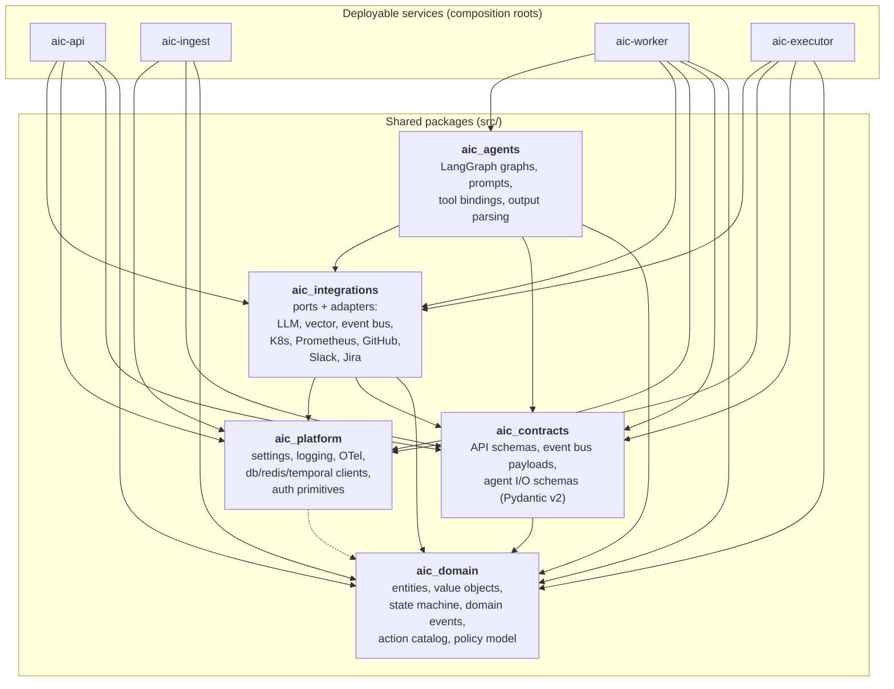
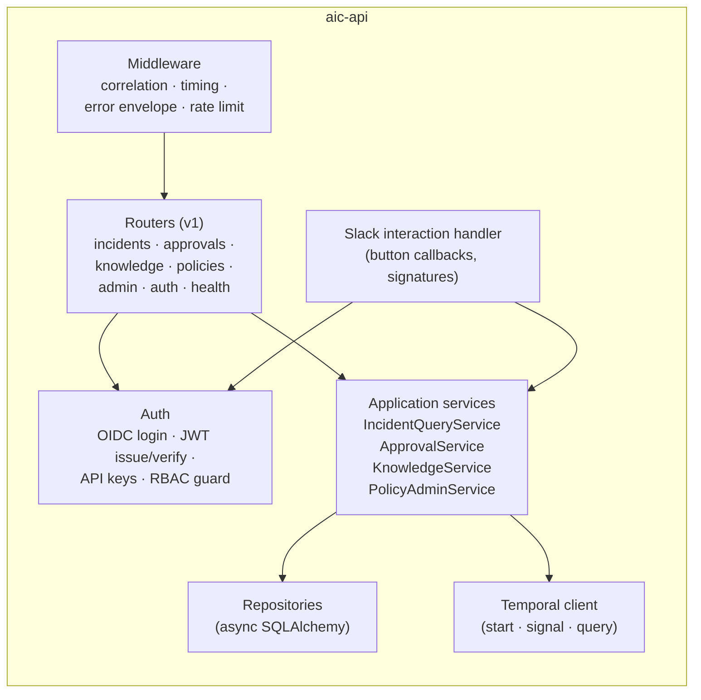
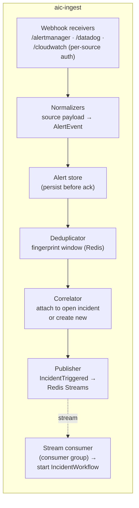
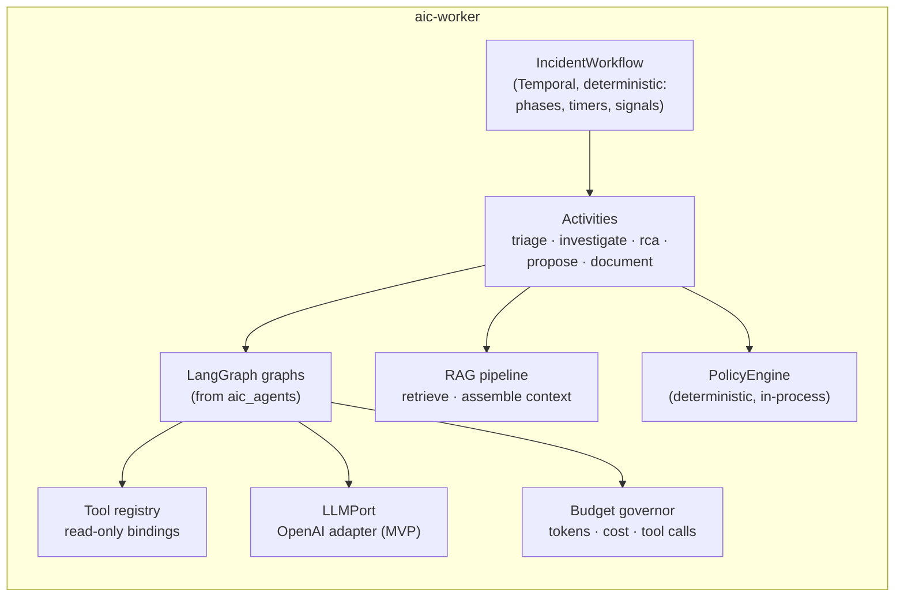
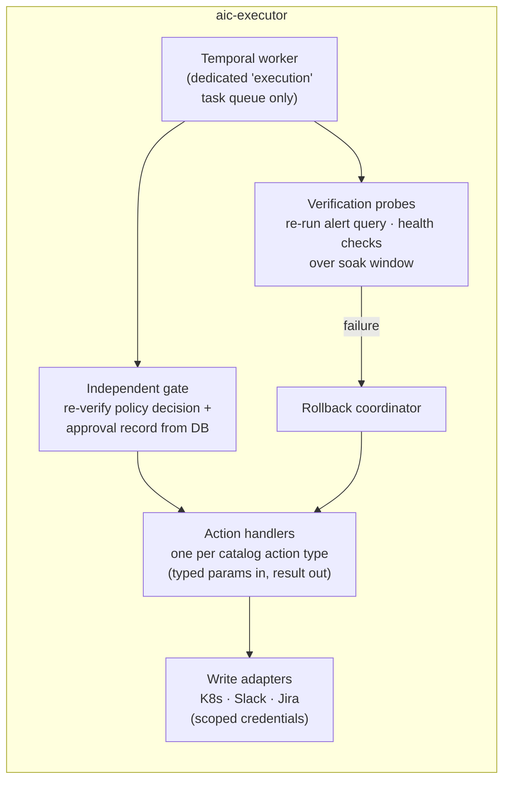

# 7. Component Diagram

Section [6.3](06-architecture.md#63-component-diagram) shows the *container* level (C4 L2): four
services and their infrastructure. This document zooms into C4 level 3: the components inside each
service, the shared packages they are built from, and the dependency rules between them.

## 7.1 Monorepo package layout

One repository, four deployable services, five shared packages. Services are thin composition
roots; almost all logic lives in packages so it is testable in isolation and shared without
duplication.

**Dependency rules (enforced by import-linter in CI):**

1. `aic_domain` imports nothing but the standard library and Pydantic. No I/O, no framework, no
   clients. This is what makes the business rules unit-testable in milliseconds.
2. `aic_contracts` depends only on `aic_domain` (schemas wrap domain types for the wire).
3. `aic_integrations` defines **ports** (abstract interfaces) alongside **adapters**
   (implementations). Consumers import ports; composition roots bind adapters.
4. `aic_agents` never imports write-capable adapters — the package literally cannot construct
   them (they live behind an executor-only extra). Privilege separation starts at import time.
5. Services import packages; packages never import services.

## 7.2 `aic-api` — control plane

Key point: `aic-api` never talks to an LLM and never holds integration credentials (Slack
signing secret excepted — it verifies inbound interaction payloads). Approvals are delivered to
running workflows as **Temporal signals**; the API is stateless.

## 7.3 `aic-ingest` — ingestion pipeline

The consumer is co-located but logically separate: at-least-once delivery + an idempotent
workflow-start (Temporal workflow ID = incident ID) means duplicate deliveries are harmless.

## 7.4 `aic-worker` — intelligence plane

The workflow itself contains **no I/O and no LLM calls** — Temporal requires workflow code to be
deterministic. All side effects live in activities; the workflow sequences them, holds timers,
and waits on approval signals.

## 7.5 `aic-executor` — execution plane

The gate re-reads the approval and policy decision from Postgres and re-evaluates policy before
touching anything — it does not trust its own caller. If `aic-worker` is compromised end to end,
the worst it can submit is a catalog action that still has to pass this gate.

## 7.6 Cross-cutting components

| Component | Lives in | Used by | Notes |
|---|---|---|---|
| `Settings` (pydantic-settings) | `aic_platform` | all | Per-service settings classes; fail-fast validation at boot |
| Structured logging (structlog → JSON) | `aic_platform` | all | trace_id + incident_id bound into every line |
| OTel tracing + Prometheus metrics | `aic_platform` | all | one trace per incident; LLM spans enriched |
| `EventBusPort` (Redis Streams adapter) | `aic_integrations` | ingest, api | Kafka adapter is a future drop-in |
| `VectorStorePort` (pgvector adapter) | `aic_integrations` | worker, api | Pinecone/Qdrant/Weaviate later |
| Redaction filter | `aic_platform` | ingest, worker | strips secrets/PII before persistence and before prompts |
