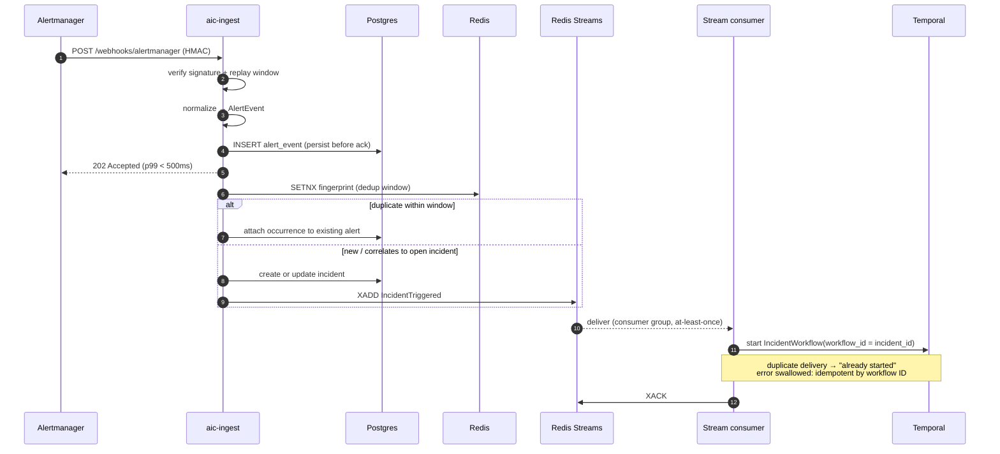
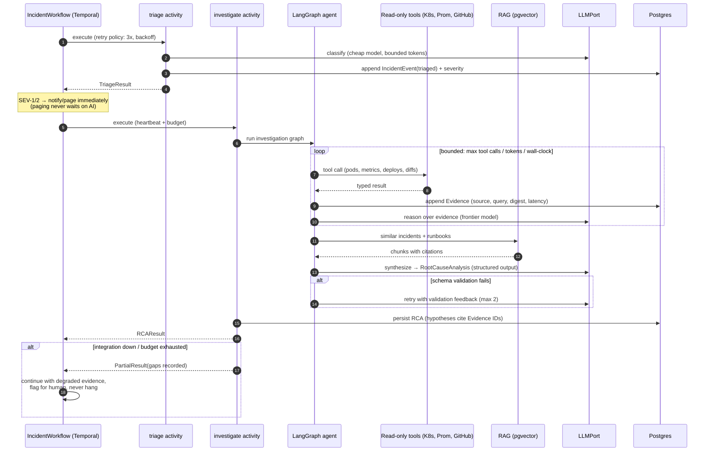
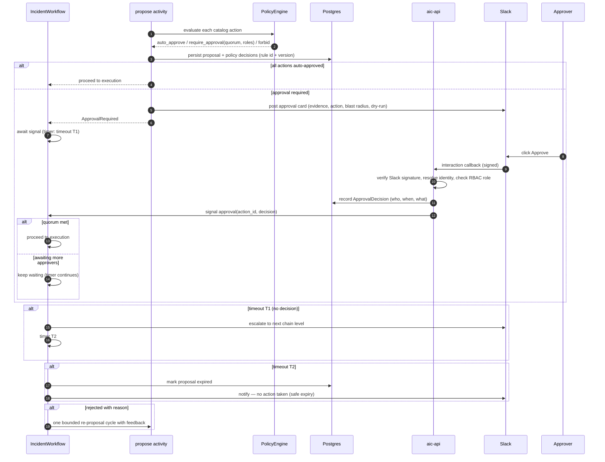
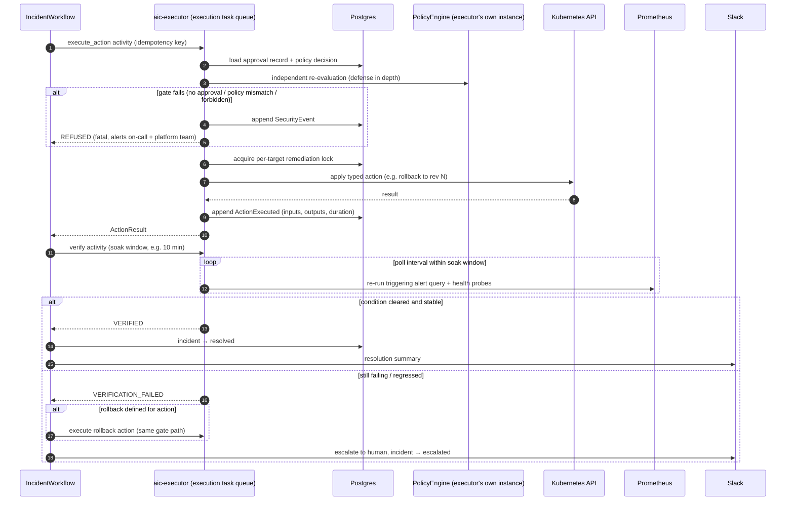

# 8. Sequence Diagrams

Four sequences cover the system's critical behavior: ingestion, investigation, approval, and
execution/verification. Failure branches are drawn in, not hand-waved — the failure paths *are*
the design.

## 8.1 Alert ingestion → durable workflow

**Why persist-before-ack:** if `aic-ingest` crashes after the 202, the alert is already in
Postgres; a reconciliation sweep re-publishes unprocessed alerts. NFR-1.2 (never lose an accepted
alert) is satisfied structurally, not by hoping the process stays up.

## 8.2 Investigation and RCA (intelligence loop)

## 8.3 Human approval (durable wait, Slack + API)

**Why a Temporal signal:** the workflow can wait minutes or days at zero cost, survive worker
restarts mid-wait, and the wait/decision/timeout history is part of the workflow's own durable,
replayable record.

## 8.4 Execution, verification, rollback

## 8.5 Cross-cutting behavior in every sequence

- **Tracing:** each sequence above is one OTel trace (or a linked continuation of the incident
  trace); every arrow is a span. LLM spans carry model/tokens/cost attributes → Langfuse.
- **Retries:** activity-level retry policies (exponential backoff, typed non-retryable errors).
  Retryable: timeouts, 429s, transient 5xx. Non-retryable: validation failures, policy refusals,
  auth errors.
- **Idempotency:** workflow ID = incident ID; action idempotency keys; event appends carry
  deterministic event IDs so at-least-once never becomes duplicate history.
