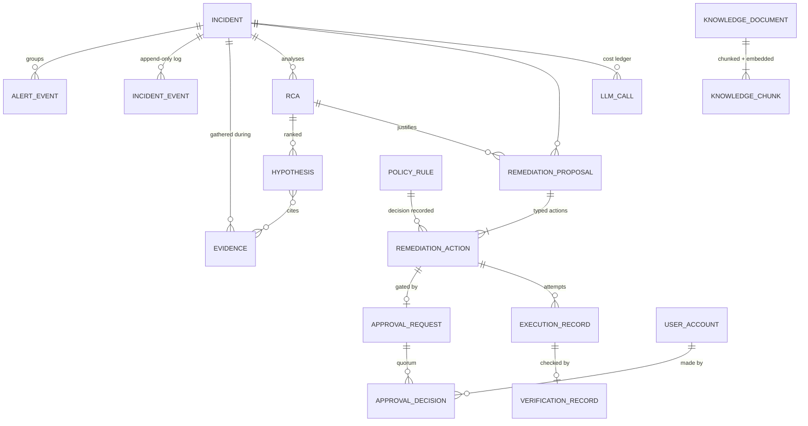

# 9. Database Design

## 9.1 What lives where (and what deliberately does not live in Postgres)

| Store | Owns | Explicitly does NOT own |
|---|---|---|
| **PostgreSQL** | System of record: incidents, events, evidence, RCA, proposals, approvals, policies, knowledge + embeddings (pgvector), identities, LLM call ledger | Workflow execution state |
| **Temporal** | Workflow progress, timers, signals, retry state, activity history | Business data (activities persist results to Postgres; Temporal payloads carry references + small DTOs, not blobs) |
| **Redis** | Dedup fingerprints (TTL), rate-limit counters, hot caches, Streams (transport) | Anything that must survive Redis loss — Redis is rebuildable by design |

**One Postgres cluster, multiple schemas** — one schema per bounded context. This gives module
isolation, per-schema grants (the security story below), and transactional consistency across
contexts, without the operational cost of separate databases. If a context ever needs to leave
(e.g. `knowledge` to a dedicated vector DB), the schema boundary is the cut line.

Schemas: `incident`, `knowledge`, `policy`, `iam`, `llmops`.

## 9.2 Entity-relationship overview



## 9.3 Key tables

Conventions: **UUIDv7 primary keys** (time-ordered → index-friendly inserts, no hotspot,
sortable); `TIMESTAMPTZ` everywhere, UTC only; `JSONB` for payloads whose shape is owned by
Pydantic contracts (schema-on-write via app validation, flexibility without migration churn);
enums as `TEXT + CHECK` (Postgres native enums make migrations painful).

### `incident.incident`

| Column | Type | Notes |
|---|---|---|
| id | uuid (v7) PK | also the Temporal workflow ID |
| fingerprint | text | correlation key (service + alert group) |
| title, summary | text | summary is agent-maintained |
| severity | text CHECK (sev1..sev4) | triage-assigned, human-overridable |
| status | text CHECK | `open, triaging, investigating, awaiting_approval, remediating, verifying, resolved, closed, escalated, failed` |
| service, environment | text | primary affected service; env drives policy |
| source | text | alertmanager / datadog / cloudwatch / manual |
| labels | jsonb | canonical label set from alerts |
| slack_channel_id, jira_issue_key | text null | external links |
| created_at, updated_at, resolved_at | timestamptz | |

Indexes: `(status) WHERE status NOT IN ('resolved','closed')` (partial — the hot working set),
`(service, created_at DESC)`, `(fingerprint, created_at DESC)`, GIN on `labels`.

### `incident.incident_event` — the audit spine

| Column | Type | Notes |
|---|---|---|
| id | uuid (v7) PK | |
| incident_id | uuid FK | |
| seq | bigint | per-incident monotonic sequence (assigned in app txn) |
| event_type | text | `created, triaged, evidence_added, rca_completed, proposal_created, approval_requested, approval_decided, action_executed, verification_completed, escalated, resolved, …` |
| actor_type | text CHECK | `human / agent / system / policy` |
| actor_id | text | user ID, agent name+version, or rule ID |
| payload | jsonb | typed per event_type (Pydantic contract) |
| trace_id | text | OTel correlation |
| created_at | timestamptz | |

**Append-only, enforced in the database, not by convention:**

```sql
REVOKE UPDATE, DELETE ON incident.incident_event FROM aic_api, aic_worker, aic_executor, aic_ingest;
-- belt-and-suspenders trigger for superuser-adjacent mistakes:
CREATE TRIGGER incident_event_immutable
    BEFORE UPDATE OR DELETE ON incident.incident_event
    FOR EACH ROW EXECUTE FUNCTION raise_immutable_violation();
```

Partitioned by month (`PARTITION BY RANGE (created_at)`) from day one — at 100M events
(NFR-3.4), retention (drop old partitions at 400 days) and vacuum behavior depend on it, and
retrofitting partitioning onto a live audit table is misery.

### `incident.evidence`

| Column | Type | Notes |
|---|---|---|
| id | uuid (v7) PK | cited by hypotheses — stable ID matters |
| incident_id | uuid FK | |
| source, tool | text | e.g. `kubernetes` / `list_pod_events` |
| query | jsonb | exact tool input (replayability) |
| result_digest | text | short LLM-consumable summary |
| result_ref | text null | pointer to full payload (object storage later; inline `result_raw jsonb` for MVP, size-capped) |
| latency_ms, collected_at | int, timestamptz | |

### `incident.rca` and `incident.hypothesis`

`rca`: id, incident_id, agent_version, prompt_hash, model, status, created_at.
`hypothesis`: id, rca_id, rank, statement (text), confidence (numeric 0–1 CHECK), reasoning,
`evidence_ids uuid[]` — **citations are foreign data, validated in app layer against
`evidence`**, stored as array for cheap reads (the ERD's M:N without a join table the domain
never queries from the other side).

### `incident.remediation_proposal`, `incident.remediation_action`

`remediation_action` is the security-critical row:

| Column | Type | Notes |
|---|---|---|
| id | uuid (v7) PK | |
| proposal_id | uuid FK | |
| action_type | text | must ∈ closed catalog (CHECK constraint generated from catalog) |
| params | jsonb | validated against the action's Pydantic schema |
| target_resource | text | e.g. `k8s:prod/payments/deploy/payment-service` — remediation lock key |
| policy_decision | text CHECK | `auto_approved / approval_required / forbidden` |
| policy_rule_id, policy_version | uuid, int | exactly which rule decided, at which version |
| status | text CHECK | `proposed, awaiting_approval, approved, rejected, expired, executing, executed, failed, rolled_back` |
| idempotency_key | text UNIQUE | safe under activity retry |
| dry_run_output | jsonb null | attached to approval card |

### `incident.approval_request` / `incident.approval_decision`

Request: action_id FK, required_quorum, required_roles text[], expires_at, escalation_level,
status. Decision: request_id FK, decider_user_id FK → `iam.user_account`, decision
(`approve/reject`), reason, decided_via (`slack/api`), decided_at. **A decision row is never
updated** — changed minds are new incidents of record, not edits.

### `knowledge.document` / `knowledge.chunk`

Document: id, title, doc_type (`runbook/postmortem/architecture/incident_record`), service,
source_url, version int, is_active bool, content_hash (skip re-embedding unchanged docs),
created_by, timestamps. Re-ingestion inserts a new version and deactivates the old — retrieval
filters `is_active`.

```sql
CREATE TABLE knowledge.chunk (
    id           uuid PRIMARY KEY,
    document_id  uuid NOT NULL REFERENCES knowledge.document(id) ON DELETE CASCADE,
    chunk_index  int  NOT NULL,
    content      text NOT NULL,
    token_count  int  NOT NULL,
    metadata     jsonb NOT NULL DEFAULT '{}',   -- service, failure_mode, headings
    embedding    vector(1536),                   -- text-embedding-3-small
    UNIQUE (document_id, chunk_index)
);
CREATE INDEX chunk_embedding_hnsw ON knowledge.chunk
    USING hnsw (embedding vector_cosine_ops);
```

HNSW over IVFFlat: better recall/latency at our scale and no training step; index build cost is
acceptable at ingest time. Embedding dimension is a **column property, not an architecture
property** — `VectorStorePort` owns it; a model change is a new column + backfill migration.

### `policy.policy_rule`

id, version (monotonic per rule), action_type, environment, effect
(`auto_approve/require_approval/forbid`), required_quorum, required_roles text[], conditions
jsonb (blast-radius predicates, e.g. `max_replicas_delta`), is_active, created_by, created_at.
Rules are **immutable rows**: editing creates version n+1 and deactivates n — so
`remediation_action.policy_rule_id + policy_version` always reproduces the exact decision basis.

### `iam.*` and `llmops.llm_call`

`iam.user_account` (external OIDC subject → local identity), `iam.role_assignment`,
`iam.api_key` (hashed, scoped, expiring). `llmops.llm_call`: incident_id, agent_role, provider,
model, prompt_hash, tokens_in/out, cost_usd numeric, latency_ms, status, trace_id, langfuse_ref —
the per-incident cost ledger (NFR-7.1) queryable in SQL, not just in Langfuse.

## 9.4 Data-integrity decisions worth defending in review

1. **UUIDv7 over UUIDv4/serial** — time-ordered (b-tree friendly, no random-insert bloat),
   globally unique (safe to generate app-side inside Temporal activities), non-guessable enough
   for external exposure.
2. **State machine in the domain layer, CHECK constraints in the DB** — the DB rejects garbage
   states; the domain rejects illegal *transitions*. Both layers, different jobs.
3. **Per-service DB roles** (`aic_api`, `aic_ingest`, `aic_worker`, `aic_executor`) with
   least-privilege grants per schema — e.g. `aic_worker` has no write on
   `incident.approval_decision`; `aic_ingest` can't touch `policy.*`. The privilege-separation
   story extends into the database.
4. **No cross-service table sharing ambiguity** — every table has exactly one writing service
   (documented per table); others read. Prevents the "shared database" integration anti-pattern
   inside the monorepo.
5. **Alembic migrations, forward-only** (NFR-10.1), generated against `aic_domain`-adjacent
   SQLAlchemy models, reviewed like code.
