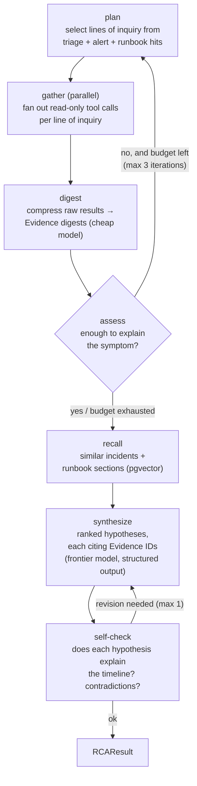

# 13. Agent Design

## 13.1 Design stance: phase-scoped agents, not one autonomous loop

AIC does **not** run a single long-lived ReAct agent that "handles the incident." It runs four
narrow agents, each scoped to one workflow phase, each with a typed input contract, a typed
output contract, and a budget. The Temporal workflow — deterministic code, not an LLM — decides
which agent runs when.

| Rejected | Why |
|---|---|
| One monolithic agent with all tools, looping until "done" | Unbounded cost/latency; un-testable; one prompt injection contaminates every downstream decision; "done" is an LLM opinion instead of a state machine |
| Autonomous multi-agent swarm (agents messaging agents) | Debugging distributed nondeterminism across probabilistic components; no enterprise story for "which agent decided what" |
| **Phase-scoped agents orchestrated by a deterministic workflow** | Each agent is separately promptable, testable, evaluable, and budgetable; control flow is replayable; blast radius of a bad output is one phase |

## 13.2 The agent roster

| Agent | Phase | Model tier | Budget (default) | Input → Output (contracts in `aic_contracts.agents`) |
|---|---|---|---|---|
| **Triage** | `triaging` | Cheap/fast (e.g. gpt-4.1-mini class) | 1 LLM call, ~2k tokens out | `TriageInput` (alert + labels + service metadata) → `TriageResult` (severity, affected services, impact class, investigation depth) |
| **Investigation** | `investigating` | Frontier for reasoning; cheap for digesting | ≤ 15 tool calls, ≤ 8 LLM calls, ≤ $1.50, ≤ 10 min | `InvestigationInput` (incident + triage + prior evidence) → `RCAResult` (ranked hypotheses citing evidence IDs) |
| **Remediation planner** | `investigating→awaiting_approval` | Frontier | ≤ 2 LLM calls | `ProposalInput` (RCA + action catalog + policy summary) → `ProposalDraft` (typed actions + rationale + rollback pairing) |
| **Scribe** | `resolved` | Cheap | ≤ 2 LLM calls | Full event log → `IncidentRecordDraft` (timeline, RCA, actions, follow-ups) |

The remediation planner is separate from investigation on purpose: proposing actions is a
different cognitive task (and a different risk class) than explaining causes, and it gets a
different prompt, a colder temperature, and the policy summary in context so it doesn't waste a
cycle proposing what policy forbids.

## 13.3 Investigation graph (the interesting one)

Properties that make this production-grade rather than a demo loop:

- **Every edge out of a loop is budget-bounded** (iterations, tool calls, tokens, wall-clock).
  Exhaustion is a *normal exit* producing partial results flagged `budget_exhausted`, never an
  exception.
- **Gather is parallel** — independent tool calls fan out concurrently (asyncio); investigation
  latency is dominated by the slowest source, not the sum.
- **Digest before reason.** Raw tool output (pod YAML, log lines) is compressed into typed
  Evidence digests by a cheap model before the frontier model reasons over it. This is
  simultaneously the cost-control, the context-budget, and part of the injection defense (§16.5).
- **The self-check node is a cheap critic, not a second opinion loop.** One bounded revision
  pass catches "hypothesis contradicts the deploy timestamp" — the highest-value eval failure we
  can automatically catch at runtime.

## 13.4 Structured output discipline

Every agent's final node emits into a Pydantic contract via constrained decoding (provider
structured-output mode where available; JSON-schema prompting as fallback):

1. Parse → validate. On failure: **retry with validation feedback** (the error list goes back
   to the model), max 2 attempts.
2. Still failing → the *activity* fails with a typed non-retryable error → workflow degrades
   (escalate with partial data). A malformed LLM response can never propagate past the parsing
   boundary.
3. Semantic validation beyond schema: hypotheses must cite existing Evidence IDs; proposed
   actions must exist in the catalog with valid params; confidences ∈ [0,1] and rank-ordered.
   Violations are validation failures, same loop.

## 13.5 Agent versioning and reproducibility

Recorded on every agent artifact (RCA, proposal, record): `agent_name`, `agent_version`
(semver, bumped on prompt/graph/tool-set changes), `prompt_hash` (content hash of the rendered
system prompt template), `model`, `provider`. Consequences:

- Any historical decision can be traced to the exact prompt + graph version that produced it.
- The eval harness (§22) pins agent versions, so a score regression is attributable to a diff.
- Prompt changes are code changes: reviewed, versioned, released — never hot-edited.

## 13.6 What agents can and cannot see

Context assembly per agent is explicit (§15.4), but the exclusions are design commitments:

- No agent sees raw secrets, credentials, or unredacted payloads (redaction runs before
  persistence *and* before prompt assembly — two independent chances to catch).
- The investigation agent does not see the action catalog (it explains; it doesn't plan).
- No agent sees approval-decision internals beyond outcome + reason (approver identity is not
  prompt material).
