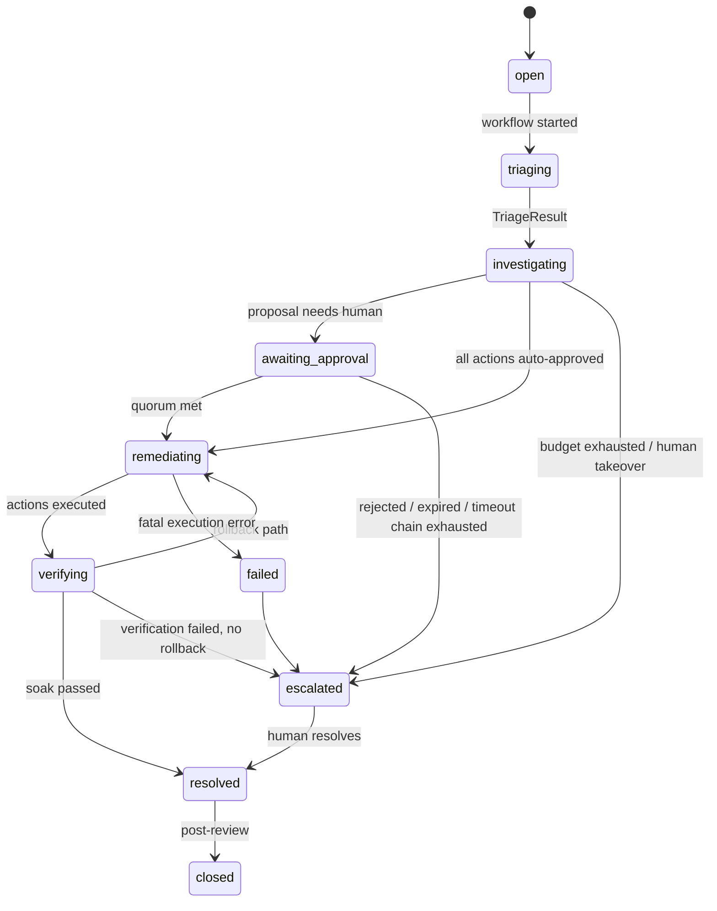

# 14. State Management

## 14.1 The four state layers and their single rule

Every piece of state in AIC has exactly one home. The rule: **a layer may cache or reference
state from the layer below it, never own a competing copy.**

| Layer | Home | Lifetime | Owns |
|---|---|---|---|
| L1 Reasoning state | LangGraph state object (in-memory, inside one activity) | One activity execution | Scratch: current plan, pending tool calls, draft hypotheses |
| L2 Workflow state | Temporal (event-sourced history) | One incident | Progress: which phase, timers, signals received, activity results (as references + small DTOs) |
| L3 Domain state | PostgreSQL | System of record, retention-bound | Facts: incidents, events, evidence, RCA, proposals, approvals, executions |
| L4 Ephemeral coordination | Redis | Seconds–hours (TTL) | Dedup fingerprints, rate/budget counters, idempotency replay cache, hot read caches |

Failure semantics follow directly: lose L1 → Temporal retries the activity (idempotent, cheap);
lose L4 → degraded-but-correct behavior (documented per key family, §11); L2 and L3 are the
durability guarantees and are backed up/replicated accordingly.

## 14.2 Workflow state: what lives in Temporal and what deliberately doesn't

The `IncidentWorkflow` is event-sourced by Temporal itself — its "state" is the deterministic
replay of its history. Inside the workflow we keep only:

- current phase + phase deadlines (timers)
- **references**: incident ID, RCA ID, proposal ID, approval request IDs
- small decision DTOs returned by activities (`TriageResult`, policy decisions)
- signal bookkeeping (approvals received, escalation level)

**Not** in workflow state: evidence bodies, LLM transcripts, tool outputs, incident records.
Those are L3 rows; activities persist them and return IDs. Two reasons:

1. Temporal history size — bloated payloads degrade replay and hit size limits; history is for
   *control flow*, not data.
2. Single source of truth — the API serves incident data from Postgres; if workflow state
   carried copies, the copies would drift.

## 14.3 Determinism constraints (the tax Temporal charges)

Workflow code is replayed to reconstruct state, so it must be deterministic. Enforced by
convention + review + a lint rule set:

- No I/O, no `datetime.now()`, no `random`, no `uuid4()` in workflow code — use
  `workflow.now()`, side-effect APIs, or push into activities.
- All nondeterminism (LLM calls, tool calls, DB access) lives in activities. Activities are the
  *only* bridge to the outside world.
- Deploy-safety: workflow code changes ship behind Temporal's **patch/versioning API** so
  in-flight incidents replay correctly on new code. A 4-hour approval wait must survive a deploy
  in the middle of it — this is a hard requirement (NFR-1.3), not a nice-to-have.

## 14.4 The incident state machine (L3) and who may move it

- Transitions are **domain operations** in `aic_domain.incidents.state` — a pure function
  `transition(current, event) -> new | IllegalTransition`. The workflow calls it; the API calls
  it (for manual operations); nothing else mutates `incident.status`.
- Every transition appends an `incident_event` in the same transaction as the status update —
  the audit spine and the state can't disagree.
- The workflow is the *driver* of automated transitions; humans drive `escalate/resolve/close`
  via API → signal. Both paths converge on the same domain function.

## 14.5 Concurrency and consistency decisions

| Problem | Decision |
|---|---|
| Same alert delivered twice | Idempotent workflow start (workflow ID = incident ID); Temporal rejects the duplicate |
| Activity retried after partial success | Every activity idempotent: writes keyed by deterministic IDs (activity-scoped UUIDv7 derivation), `ON CONFLICT DO NOTHING` for appends, idempotency keys for actions |
| Two approvers decide simultaneously | `approval_decision` insert with unique `(request_id, decider)`; quorum evaluated in one serializable transaction; workflow signal is idempotent (signal dedup by decision ID) |
| Concurrent remediation on one target | Per-target advisory lock row (`remediation_action.target_resource`); second action queues or fails fast per policy |
| API reads during workflow writes | Plain read-committed reads — the event log is append-only, so readers see a consistent prefix; no distributed transactions anywhere |
| Workflow history growth (very long incidents) | `continue_as_new` after N events/days carrying only the compact state DTO forward |

## 14.6 What this buys operationally

- **Crash anywhere, resume exactly.** Kill any pod mid-investigation: Temporal reschedules the
  activity; completed work is in Postgres; nothing re-reasons from scratch beyond the current
  activity.
- **Time travel for debugging.** Temporal Web shows the full decision history of any incident's
  control flow; Postgres shows every fact it produced; the OTel trace ties both to wall-clock
  performance.
- **No background-job archaeology.** There are no orphaned Celery tasks or "is the cron stuck?"
  questions — if an incident is open, exactly one workflow owns it, queryable by ID.
